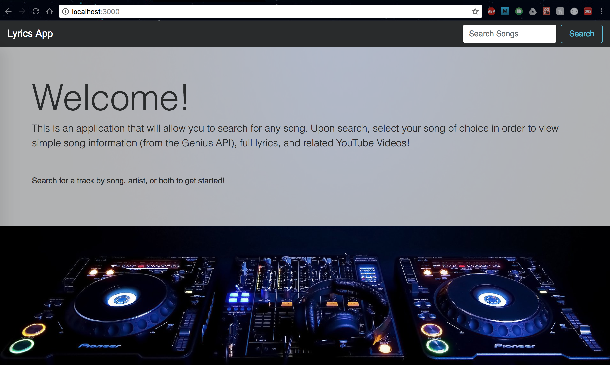
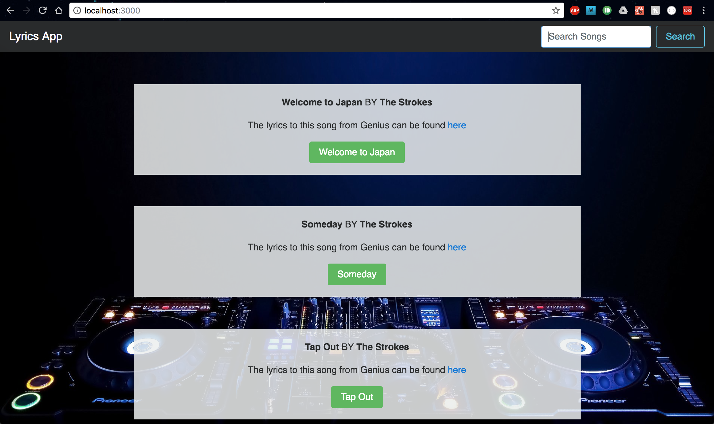
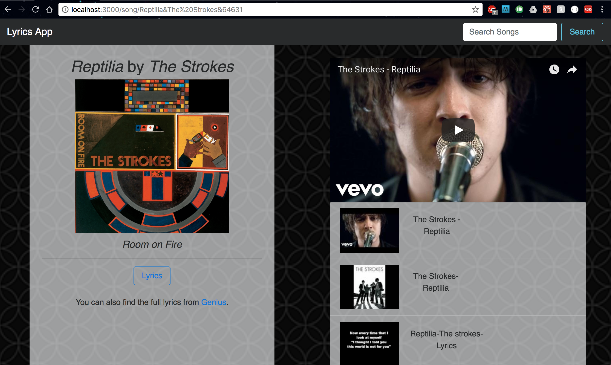

# Lyrics App

## Project Description
This project was created with the initial purpose of being able to easily get the lyrics of any given song. The final result includes basic track information with album art (if available) and related YouTube videos. Track search and information is retrieved using the Genius API, YouTube API for the YouTube videos, and a web scraper to grab the lyrics from a given URL. This project is not for commericial use and was meant for personal use only.

## Project Live Link
[Lyrics App](https://hidden-beach-37577.herokuapp.com/)

## Project Screenshots







## Project Stack

### Front End
* ReactJS v16
* ReactRedux
* Redux
* React-Router v4

### Back End
* Node Express Server

### Used NPM Packages
* youtube-api-search
* axios
* node-genius
* scraperjs

## How To Run

### Clone the repo
Checkout this repo and install the dependencies

```
/> git clone https://github.com/arendon13/Lyrics.git
/lyrics> npm install
/> npm install
```

### Configuration Setup
Two `dev.js` files will need to be setup in both the Front End and Back End in order for this project to function as expected.

#### Front End Configuration
The `dev.js` will include the Google API Key. You can get your own API from the official YouTube Data API [guide](https://developers.google.com/youtube/v3/getting-started). The file should be placed in the `/lyrics/src/` directory. See below for an example of how the file should look:

```javascript
module.exports = {
  youtubeAPI: <Your Key Here!>,
  hostURL : 'http://localhost:3030'
}
```

#### Back End Configuration
This `dev.js` file will include the Genius API Client Access Token. You can get one for the Genius [API Client Management Page](https://genius.com/api-clients). The file should be place in the `/lyrics_auth/` directory. Below is an example on how the file should look:
```javascript
module.exports = {
  geniusAPI: <Your Access Token>
}
```

### Run the Front End Server
In the `/lyrics/` directory run the following command:
```
> npm run start
```

### Run the Back End Server
In the root directory run the following command:
```
> npm run dev
```
